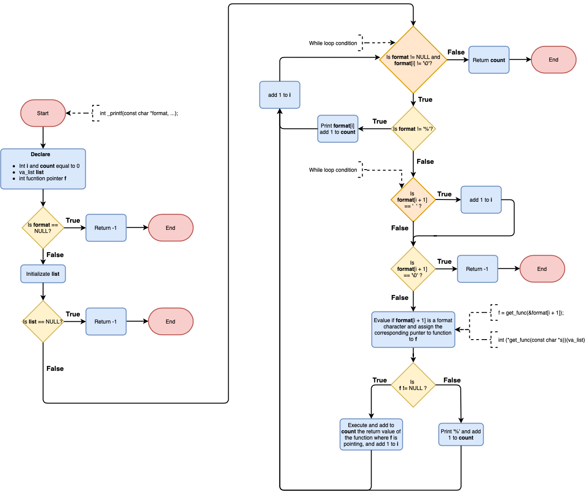

# printf

Function that prints arguments and data.  Arguments type: c, s, %, d, i and b.

## Files

1. [_printf.c](https://github.com/NaranjoJorge/printf/blob/master/_printf.c) - File that contains: (1) the main function (int _printf(const char *format)),  and (2) function pointer to array structure.
2. [_putchar.c](https://github.com/NaranjoJorge/printf/blob/master/_putchar.c) - File that contains _putchar function which writes characters, one by one, to standard output.
3. [formatf.c](https://github.com/NaranjoJorge/printf/blob/master/formatf.c) - File that contains functions (for when arguments are type: c, s, %, i or d) pointed by function pointer define in structure struct formato (typedef fmt) on file holberton.h.
4. [formatf2.c ](https://github.com/NaranjoJorge/printf/blob/master/formatf2.c) - Same as formatf.c but for arguments types: b, u and o.
5. [holberton.h  ](https://github.com/NaranjoJorge/printf/blob/master/holberton.h)- Library with fucntions prototypes, and struct format (typedef fmt) that contains (1)pointer and (2)function pointer. 
6. [main.c  ](https://github.com/NaranjoJorge/printf/blob/master/test/main.c)- In test directory. File to test _printf.c .  

### Compilation

gcc -Wall -Werror -Wextra -pedantic *.c

## Code Style

[Betty](https://github.com/holbertonschool/Betty/wiki)

## Flow Chart

## Authors

- **Santiago Peña** 
- **Jorge Naranjo** 

## Acknowledgments

* Holberton School
